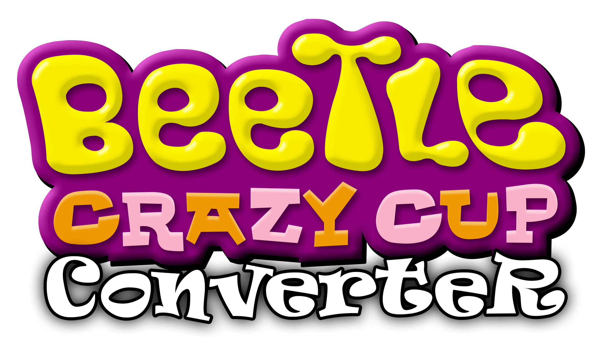

Beetle Crazy Cup Remake Save Converter
=============

Save converter from original Beetle Crazy Cup/Beetle Buggin'/Käfer Total/Radical Drive to Remake version.

The latest version of the converter will be delivered immediately with the game.

# Features

- Transfers absolutely all the progress from the original to the remake.
- If the final challenge was passed in the original game, then the player will be given a cut-out car from the beta version in speed mode.
- You can choose as you wish the .usr file is in the window, and just drag & drop into the program.

# Requirements

- Place the program in the root folder of the remake. (optional)
